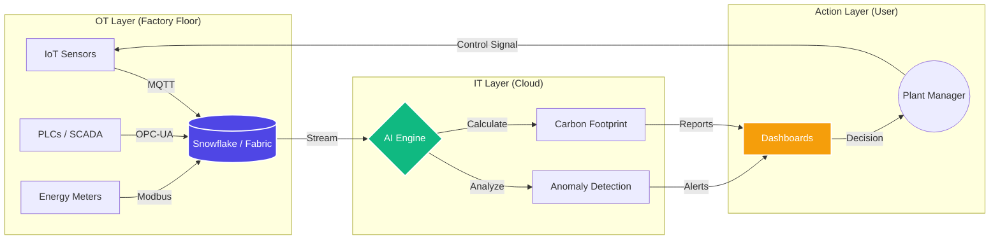
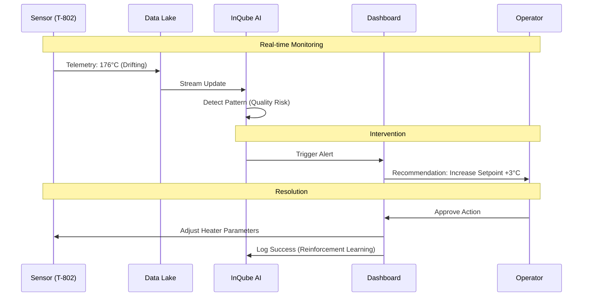

# InQube Manufacturing Intelligence MVP

> **Bridging the gap between Operational Technology (OT) and Information Technology (IT).**
> A comprehensive suite of dashboards for the modern smart factory.

---

## 🌐 Live Demonstrations

This repository hosts three distinct dashboards, each serving a specific strategic purpose in the manufacturing lifecycle.

| Dashboard | Purpose | Live Link |
| :--- | :--- | :--- |
| **1. Factory Command Center** | **Macro View:** Full factory visibility (Cutting, Sewing, Finishing). Connects shop-floor IoT to executive KPIs. | [🚀 Launch Dashboard](https://factory-portfolio.randunun.workers.dev) |
| **2. InQube Smart Lab** | **Micro View:** Predictive quality control for the **Smart Bra Lamination** process. Features Agentic AI for anomaly detection. | [🚀 Launch Dashboard](https://inqube-demo.randunun.workers.dev) |
| **3. Carbon Intelligence** | **Strategic View:** Machine-level carbon accounting. Enables UNGC & SBTi compliance reporting using real telemetry. | [🚀 Launch Dashboard](https://carbon-intelligence.randunun.workers.dev) |

---

## 🧠 System Architecture

### 1. The Data Pipeline
How we turn physical machine signals into business intelligence.



### 2. The AI Decision Loop (Agentic Workflow)
How the "Smart Lab" dashboard prevents defects before they happen.



---

## 🚀 Key Features

*   **Real-time Visualization**: High-frequency data rendering using Chart.js and WebSockets (simulated).
*   **Agentic AI**: "Human-in-the-loop" interface where AI proposes actions and operators approve/reject.
*   **Sustainability Tracking**: ISO 14064-1 compliant carbon accounting at the machine level.
*   **Premium UI**: "Industrial Future" aesthetic designed for modern control rooms (Glassmorphism, Dark Mode).
*   **Edge Native**: Deployed on Cloudflare Workers for global low-latency access (<50ms).

## 🛠️ Technology Stack

*   **Runtime:** Cloudflare Workers (Serverless)
*   **Frontend:** HTML5, Tailwind CSS, Vanilla JS
*   **Visualization:** Chart.js
*   **Icons:** Phosphor Icons
*   **Deployment:** Wrangler CLI

---

## 📦 Local Development

1.  **Clone the repository**
    ```bash
    git clone https://github.com/randunun-eng/inqube-mvp.git
    cd inqube-mvp
    ```

2.  **Install Dependencies**
    ```bash
    npm install
    ```

3.  **Run Dashboards Locally**
    ```bash
    # Run Factory Command Center
    npx wrangler dev --config wrangler-factory.toml

    # Run Smart Lab Monitor
    npx wrangler dev --config wrangler.toml

    # Run Carbon Intelligence
    npx wrangler dev --config wrangler-carbon.toml
    ```

---

## ⚠️ Prototype Disclaimer
*This project is a 24-hour MVP demonstration using simulated data streams. In a production environment, this architecture connects to real PostgreSQL/TimescaleDB instances and live IoT telemetry.*
