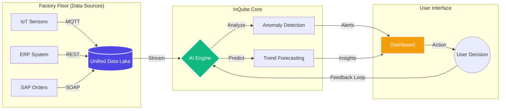
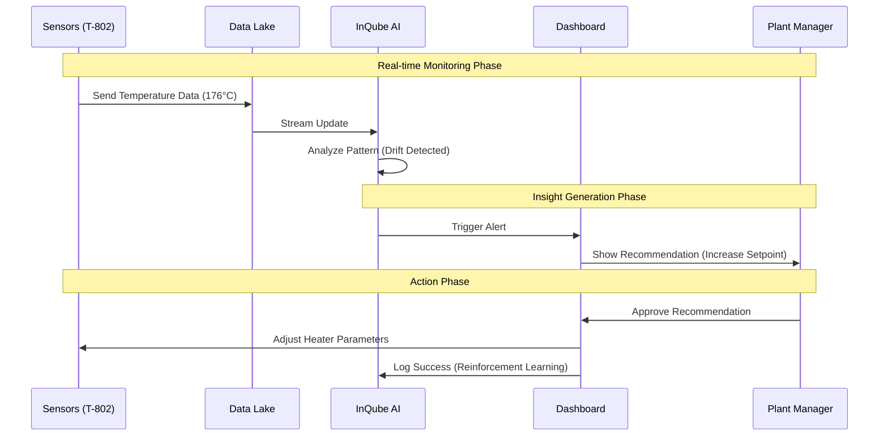

# InQube Manufacturing Intelligence MVP

> **A Next-Gen Manufacturing Intelligence Dashboard powered by Cloudflare Workers.**
> Real-time monitoring, AI-driven insights, and seamless data integration.

---

## 🧠 Graphical Brainstorm: The Process

### 1. High-Level Architecture
How data flows from the factory floor to the decision-maker.



### 2. The AI Decision Loop
How the system turns raw data into actionable recommendations.



---

## 🚀 Key Features

*   **Real-time Visualization**: Live charts and KPI monitoring using Chart.js.
*   **AI-Driven Insights**: Automatic anomaly detection and actionable recommendations.
*   **Interactive Decision Making**: "Human-in-the-loop" interface for approving/rejecting AI suggestions.
*   **Premium UI**: "Industrial Future" aesthetic with glassmorphism and Tailwind CSS.
*   **Edge Deployed**: Runs globally on Cloudflare Workers for <50ms latency.

## 🛠️ Technology Stack

| Component | Technology |
| :--- | :--- |
| **Runtime** | Cloudflare Workers (Serverless) |
| **Frontend** | HTML5, Tailwind CSS, Vanilla JS |
| **Visualization** | Chart.js |
| **Icons** | Phosphor Icons |
| **Deployment** | Wrangler CLI |

## 📦 Setup & Deployment

1.  **Clone the repository**
    ```bash
    git clone https://github.com/randunun-eng/inqube-mvp.git
    cd inqube-mvp
    ```

2.  **Install Dependencies**
    ```bash
    npm install
    ```

3.  **Run Locally**
    ```bash
    npx wrangler dev
    ```

4.  **Deploy to Cloudflare**
    ```bash
    npx wrangler deploy
    ```

---

## ⚠️ Prototype Disclaimer
*This is a 24-hour MVP demonstration using simulated data. In a production environment, this would connect to real PostgreSQL/TimescaleDB instances and live IoT telemetry streams.*
